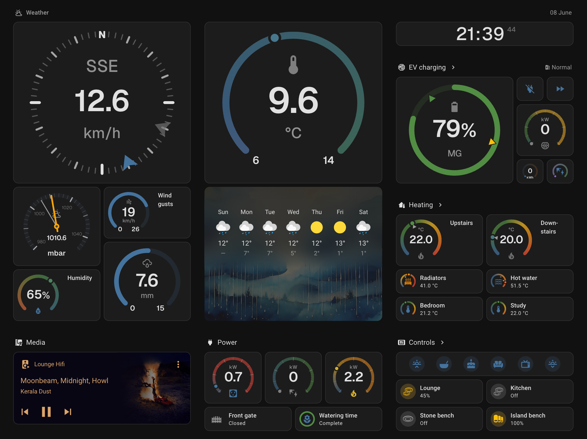

# Ring Tile Card

It's a [Home Assistant](https://www.home-assistant.io) `tile` card! With a ring!

A card based on the fabulous inbuilt [`tile` card](https://www.home-assistant.io/dashboards/tile/) to visualise your sensor data. Use `ring-tile` cards to bring your sensor `tile` cards to life. Gain insights from your home's data at a glance.

You can make the ring the star of the show for new, bigger tiles. Here's a cluster of weather sensors.

Or a cluster of sensors to monitor a server.

Or you can go *really* big to make whole new dashboards - good for wall displays. `ring-tile` looks great in dark mode too!

## Using ring-tile card

`ring-tile` card has been designed for ease of use: it requires minimal configuration to get a great looking result. You can use it as a drop-in replacement for the inbuilt `tile` card (**Note!** at the moment, `ring-tile` card only works properly with `sensor` entities. Not all native `tile` card options are supported). 

### Documentation

Read how to install and use `ring-tile` card:

* [Installation](https://github.com/neponn/ring-tile-card/blob/main/docs/install.md) using [HACS](https://www.hacs.xyz/docs/use/)
* Get started with a bunch of [examples](https://github.com/neponn/ring-tile-card/blob/main/docs/examples.md)
* Full [configuration](https://github.com/neponn/ring-tile-card/blob/main/docs/config.md) options
* A few [advanced](https://github.com/neponn/ring-tile-card/blob/main/docs/advanced.md) options using [card-mod](https://github.com/thomasloven/lovelace-card-mod) for dynamic styling as well as some useful custom sensors

## Discussion

If you need help or would like to discuss `ring-tile` card, reach out on the [Home Assistant community forum](https://community.home-assistant.io/t/ring-tile-card-visualise-your-sensor-data/899257). I would love to know how you are using `ring-tile` card - share a few screen shots and YAML config!

## Support

If something is broken or you have an idea about how to make `ring-tile` card better, create a bug report or feature request [issue](https://github.com/neponn/ring-tile-card/issues). Even better, fork and create a pull request!

