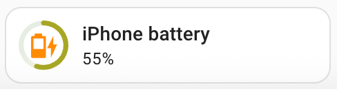
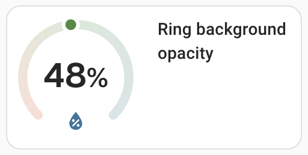
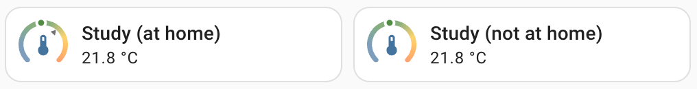

**docs** | [Read me](../README.md) | [Installation](install.md) | [Examples](examples.md) | [Configuration](config.md) | **Advanced** |

# Advanced configuration

`ring-tile` doesn't support templating. To avoid too much configuration complexity, `ring-tile` has been designed to work well with [`card-mod`](https://github.com/thomasloven/lovelace-card-mod), which supports templating very well. 

If you haven't used it before, `card-mod` is an awesome plugin that enables you to dynamically manipulate the styling of any Home Assistant card. Make sure you are familiar with it before reading on.

There are two ways in which `ring-tile` has been designed for `card-mod` use: [overriding CSS colour variables](#overriding-css-colour-variables) and [manipulating `ring-tile` HTML / SVG elements](#manipulating-ring-tile-html--svg-elements).

## Overriding CSS colour variables

Best to start with an example.



```yaml
type: custom:ring-tile
entity: sensor.iphone_battery_level
card_mod:
  style: |
    * {
      --rt-icon-color: {{ 
          "darkorange" 
          if states("sensor.iphone_battery_state") == "Charging"
          else "var(--)" 
        }};
    }
```

In this example, the colour of the icon is changed to `darkorange` if the iPhone battery is charging (default colour if not). This is achieved by using a `card-mod` style template to dynamically update the `--rt-icon-color` CSS variable.

Another example: you can statically change the opacity of the ring background.



```yaml
type: custom:ring-tile
entity: sensor.humidity
ring_size: 2
card_mod:
  style: |
    * {
      --rt-ring-background-opacity: 20%;
    }
```

### CSS variables available

`ring-tile` offers the following CSS variables:

| CSS variable | Purpose | Type | Default |
|--------------|---------|------|---------|
| `--rt-icon-color` | Override icon colour | CSS colour code | `ha_blue` middle and bottom positions; `ha_grey` top |
| `--rt-top-icon-opacity` | Icon opacity when rendered in top position | `0%`-`100%` | `50%` |
| `--rt-ring-background-opacity` | Opacity used for the ring background  | `0%`-`100%` | depends on ring |
| `--rt-background-text-opacity` | Text opacity used for top, bottom and units | `0`-`1` | `0.6` |
| `--rt-scale-text-opacity` | Text opacity used for scale labels | `0`-`1` | `0.5` |
| `--rt-pointer-colour` | Override the `pointer` colour | CSS colour code | `orange` |
| `--card-mod-icon` | Override the configured icon (`card_mod` [feature](https://github.com/thomasloven/lovelace-card-mod#changing-icons)) | HA icon code (eg `mdi:eye`) | per config |

### Home Assistant friendly colours

Note that [colour shortcuts](config.md/#home-assistant-friendly-colour-shortcuts) provided by `ring-tile` **do not** work with `card_mod`. You can achieve a similar result using Home Assistant built in CSS colour variables, [see below](#ha-friendly-colour-alternatives).

## Manipulating ring-tile HTML / SVG elements

You can get even more dynamic control over `ring-tile` by directly manipulating the HTML / SVG elements themselves. 

### Example



My study is only heated if I am working at home. To show when my study is being heated, I only show the thermostat setpoint as a marker when I am working at home. To do this, I target the `visibility` attribute of the `g.marker` SVG element, which sits below the `rt-ring-svg` element, separated by a shadow-root (`$`). Config as follows:

```yaml
type: custom:ring-tile
entity: sensor.temperature_study
marker: input_number.study_boost_temperature
bottom_element: none
card_mod:
  style:
    rt-ring-svg $: |
      g.marker {
        visibility: {{ 
          'hidden' if states('binary_sensor.working_at_home') == 'off' 
          else 'visible'
        }};
      }
```

### Ring tile DOM structure

`ring-tile` uses structured class names to make it easier to select elements for targeted `card-mod` styling. Here are a few guidelines.

* The top level element is `ring-tile`
* Ring elements live in a shadow-root inside `rt-ring-svg`
  * To access ring elements, use `rt-ring-svg $: |` before selecting the targeted elements (like in the example above)
* Icons are rendered as HTML, top level `ha-state-icon` (a Home Assistant component, which actually renders the icon as SVG in the end)
* All other elements are rendered as SVG, split into three groups, with class names assigned as follows:
  * `elements`: these are the `top` / `middle` / `bottom` elements
  * `ring`: the ring itself, plus an optional `scale` group, containing:
    * `ticks` and `labels` groups
  * `indicators`: a group containing the indicator and markers:
    * `dot` indicator consisting of `dot` and `dot-outline`
    * `arc` indicator consisting of `ring-solid`
    * `pointer` indicator consists of SVG objects with class names `pointer` and `pointer-centre` contained in a group
    * `marker` group

The easiest way to find your way around the DOM is to use a browser inspector (F12 / ⌘-shift-C).

## Handy custom sensors for use with ring-tiles

I have made a few custom sensors to help with certain `ring-tile` use cases. Fair warning: there might be better ways to do these things, but here is how I did it.

### Pressure 6 hours ago

When configuring a barometer, it's helpful to add a marker that shows the pressure a little while ago so that you can see atmospheric pressure trends. I found 6 hours prior works well.

Assuming you have an an atmospheric pressure sensor named `sensor.pressure` and `sensor`s are tracked in your [recorder](https://www.home-assistant.io/integrations/recorder/) database, you can define an `sql` sensor that looks back in history. Note there is a risk that `sql` sensors break if the HA devs change the database schema.

```yaml
sql:
  - name: Pressure 6 hours ago
    db_url: !secret recorder_db
    query: >
      SELECT ROUND(avg(CAST(s.mean AS DECIMAL(10, 1))), 1) pressure_6hr_ago,
          COUNT(*) samples
      FROM statistics_short_term s
          LEFT JOIN statistics_meta sm ON (s.metadata_id = sm.id)
      WHERE sm.statistic_id = 'sensor.pressure'
          AND unix_timestamp(NOW()) - s.start_ts > (5.8 * 3600)
          AND unix_timestamp(NOW()) - s.start_ts < (6.2 * 3600)
          AND s.mean != 'unknown'
          AND s.mean != 'unavailable'
      LIMIT 1
    column: pressure_6hr_ago
    unit_of_measurement: mbar
    device_class: pressure
    state_class: measurement
```

### Wind direction average

When using a compass ring to show wind direction and strength, I find my rooftop wind sensor produces quite noisy results as it spins about in the wind. But over the long term, general direction is quite reliable. I find that a wind direction marker based on a circular mean over the past 15 minutes works pretty well.

Assuming your wind direction sensor is named `sensor.wind_direction`:

```yaml
sensor:
  - platform: statistics
    name: Wind direction 15 min
    entity_id: sensor.wind_direction
    state_characteristic: mean_circular
    max_age:
      minutes: 15
```

## HA friendly colour alternatives

Home assistant comes with a bunch of CSS colour variables, which you can use in your `card_mod` styles to match the HA aesthetic:

-  `--primary-text-color: #212121;` (Adapts to dark / light)

-  `--secondary-text-color: #727272;` (Adapts to dark / light)

-  `--disabled-color: #bdbdbd;` (Adapts to dark / light)

-  `--card-background-color: #ffffff;` (Adapts to dark / light)

-  `--state-icon-color: #44739e;`

-  `--red-color: #f44336;`

-  `--pink-color: #e91e63;`

-  `--purple-color: #926bc7;`

-  `--deep-purple-color: #926bc7;`

-  `--indigo-color: #3f51b5;`

-  `--blue-color: #2196f3;`

-  `--light-blue-color: #03a9f4;`

-  `--cyan-color: #00bcd4;`

-  `--teal-color: #009688;`

-  `--green-color: #4caf50;`

-  `--light-green-color: #8bc34a;`

-  `--lime-color: #cddc39;`

-  `--yellow-color: #ffeb3b;`

-  `--amber-color: #ff9800;`

-  `--orange-color: #ff9800;`

-  `--deep-orange-color: #ff6f22;`

-  `--brown-color: #795548;`

**Note!** Home Assistant devs may change these at any time!

##

**docs** | [Read me](../README.md) | [Installation](install.md) | [Examples](examples.md) | [Configuration](config.md) | **Advanced** |