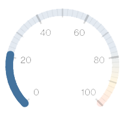
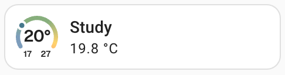
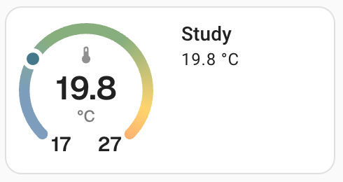

**docs** | [Read me](../README.md) | [Installation](install.md) | [Examples](examples.md) | **Configuration** | [Advanced](advanced.md) |

# Configuring Ring Tile Card

This page describes the configuration options and how they work.

## Configuration options

`ring-tile` configuration options are as follows. 

| Name | Type | Default | Description |
|------|------|---------|-------------|
| `type` **(required)** | string | | `custom:ring-tile` |
| `entity` **(required)** | [string or dictionary](#specifying-entities-or-entity-attributes) | | The sensor [entity or entity attribute](#specifying-entities-or-entity-attributes) to visualise |
| `ring_entity` | [string or dictionary](#specifying-entities-or-entity-attributes) | | An optional sensor [entity or entity attribute](#specifying-entities-or-entity-attributes) used only to determine the state of the ring, separate from the main `entity` |
| `name` | string | | Override the `entity`'s `friendly_name`, if it has one. Used in both the ring and the info area |
| `icon` | string | | Override the `entity`'s icon, if it has one |
| `ring_type` | string | `closed` | Specifiy the [type of ring](#ring-type-options): `open`, `closed`, `compass[_n\|_nesw]` or `none` |
| `ring_size` | integer | 1 | The size of the ring, from 1 to 6. Ring size translates to number of native `tile` card rows |
| `indicator` | string | `arc` | Specify how to [indicate](#indicator-options) the current entity value: `dot`, `arc`, `pointer` or `none` |
| `ring_only` | boolean | `false` | Enable / disable the info panel to the right of the ring. `true` for `ring_size` ≥ 3 |
| `scale` | string | `none` | Render a [scale](#scale-options) on the ring (or not): `none`, `ticks`, `ticks_with_labels` |
| `min` | number, [string or dictionary](#specifying-entities-or-entity-attributes) | 0 | Specify the minimum value indicated on the ring. Can be an absolute number or can be dynamically determined by providing the name of a sensor [entity or entity attribute](#specifying-entities-or-entity-attributes) |
| `max` | number, [string or dictionary](#specifying-entities-or-entity-attributes) | 100 | Specify the maximum value indicated on the ring. Can be an absolute number or can be dynamically determined by providing the name of a sensor [entity or entity attribute](#specifying-entities-or-entity-attributes) |
| `colour` / `color` | string or dictionary | [see below](#setting-ring-colours) | Specify the [colour of the ring](#setting-ring-colours), either as a single colour, or a dictionary of colours to make a smooth colour gradient. |
| `colourise_icon` / `colorize_icon` | boolean | `false` | Colour the icon to match the state of the ring |
| `marker` | number, [string or dictionary](#specifying-entities-or-entity-attributes) | | Specify an optional marker to point to a position on the ring. Can be an absolute number or can be dynamically determined by providing the name of a sensor [entity or entity attribute](#specifying-entities-or-entity-attributes) |
| `marker2` | number, [string or dictionary](#specifying-entities-or-entity-attributes) | | Specify an optional second marker |
| `marker_colour` (or `marker_color`) | string | grey | Specify the colour of the marker. Any valid CSS will do, or a Home Assistant friendly [colour shortcut](#home-assistant-friendly-colour-shortcuts) |
| `marker2_colour` (or `marker2_color`) | string | light grey | Specify the colour of  marker2 |
| `compass_marker` | string | `arrow_in` | For `compass` rings, the marker can be configured to point inwards (`arrow_in`), outwards (`arrow_out`), or can just be a dot (`dot`) |
| `compass_marker2` | string | `arrow_in` | For `compass` rings, configure `marker2` appearance |
| `top_element` | string | `none` | Specify what to render [inside the ring](#ring-element-options) at the top: `none`, `icon`, `marker`, `marker_with_unit`, `marker_dir`, `unit` |
| `middle_element` | string | `icon` | Specify what to render [inside the ring](#ring-element-options) in the middle: `none`, `name`, `icon`, `value`, `value_with_unit`, `ring_value`, `ring_value_with_unit` |
| `bottom_element` | string | `none` | Specify what to render [inside the ring](#ring-element-options) at the bottom: `none`, `name`, `icon`, `min_max`, `unit`, `ring_unit`, `value`, `value_with_unit`, `ring_value`, `ring_value_with_unit` |
| `min_sig_figs` | number | 2 | Specify the minimum number of significant figures to use when rendering a value inside the ring. This can be more useful than the conventional `display_precision` to keep the width of the rendered value reasonably consistent. By way of example, a setting of 2 will produce output like 0.12, 1.2 or 12 |
| `max_decimals` | number | 1 | Used with `min_sig_figs` to provider further control over the rendering of values inside the ring. The default settings of `min_sig_figs: 2` and `max_decimals: 1` will produce output like 0.1, 1.2, 12 |
| `hide_state` | boolean | `false` | Enable or disable the entity value in the info area to the right of the ring |
| `tap_action` | map | `action: more-info` | Specify the action that should be taken when tapping on `ring-tile` card. By default, show `more-info` for the `entity`. All standard `action` [config options](https://www.home-assistant.io/dashboards/actions/) supported. |
| `hold_action` | map | | Action take on tap-and-hold. See `action` [config options](https://www.home-assistant.io/dashboards/actions/) |
| `double_tap_action` | map | | Action take on double tap. See `action` [config options](https://www.home-assistant.io/dashboards/actions/) |
| `icon_tap_action` | map | `action: more-info` | Specify the action that should be taken when tapping on the icon / ring. By default, show `more-info` for the `entity` (or `ring_entity` if defined). All standard `action` [config options](https://www.home-assistant.io/dashboards/actions/) supported. |
| `icon_hold_action` | map | | Action take on icon / ring tap-and-hold. See `action` [config options](https://www.home-assistant.io/dashboards/actions/) |
| `icon_double_tap_action` | map | | Action take on icon / ring double tap. See `action` [config options](https://www.home-assistant.io/dashboards/actions/) |

Defaults shown in the table are for a `ring_size: 1`, where no `device_class` has been detected. As [described below](#default-handling), alternative defaults may be applied based on detected `device_class` and `ring_size`. Your settings always override defaults.

### Ring type options

Multiple `ring_type` options are available.

| `ring_type` | Looks like | Comment |
|-------------|:----------:|---------|
| `open` |  | General purpose ring |
| `closed` |  | General purpose ring; useful for sensors that indicate consumption or capacity |
| `compass` |  | A 360° compass rose, useful for plotting direction using `marker`s. Use `compass_n` and `compass_nesw` to add the corresponding cardinal labels. Note that a `ring_size` of 2 is selected by default |
| `none` | | No ring |

### Indicator options

Indicators show the current `entity` (or `ring_entity` if defined) sensor value on the ring, positioned relative to the `min` and `max`.

| `indicator` | Looks like | Comment |
|-------------|:----------:|---------|
| `dot` |  | Good general purpose indicator; reveals more of the gradient colouring. Doesn't work so well with `closed` rings |
| `arc` |  | Also general purpose, but well suited for consumption / capacity metrics. Can be easier to read |
| `pointer` |  | Great for use with [scales](#scale-options). Works best at `ring_size` ≥ 2 |
| `none` |  | No indicator. Most useful with `compass` rings |

### Scale options

A scale can be applied to a ring. Note that the scale is rendered *on top* of the ring background but *underneath* the ring indicator. A scale can be added to any `ring_size`, but scales works better with `ring_size: 2` and best with `ring_size: 3` and above.

| `scale` | Looks like | Comment |
|---------|------------|---------|
| `ticks` |  | Just tick marks |
| `ticks_with_labels` |  | Ticks and labels. More or less labels will be added depending on the `ring_size` |
| `none` |  | No scale; just the ring |

### Ring element options

You can decide what is displayed inside the ring. The interior is divided into three areas: top, middle and bottom. `ring-tile` will scale and position elements into each of these areas as best it can. Smaller rings benefit from fewer elements.

| Option | `top _element` | `middle _element` | `bottom _element` | Comment |
|--------|:-----:|:--------:|:--------:|---------|
| `none` | ☑️ | ☑️ | ☑️ | No element |
| `icon` | ☑️ | ☑️ | ☑️ | Show the `entity`'s icon (or the configured `icon`) |
| `min_max` | | | ☑️ | Show the ring's `min` and `max` values at the ring's end points |
| `value` | | ☑️ | ☑️ | Show the `entity`'s current value |
| `value_with_unit` |  | ☑️ | ☑️| show the `entity`'s current value and unit. See note below about unit handling |
| `ring_value` |  | ☑️ | ☑️ | Show the `ring_entity`'s current value |
| `ring_value_with_unit` |  | ☑️ | ☑️ | show the `ring_entity`'s current value and unit. See note below about unit handling |
| `unit` | ☑️ |  | ☑️| Show the `entity`'s unit |
| `ring_unit` |  | | ☑️| Show the `ring_entity`'s unit |
| `marker` | ☑️ |  |  | Show the current value of the `marker` |
| `marker_with_unit` | ☑️ |  |  | Show the current value and unit of the `marker` |
| `marker_dir` | ☑️ |  |  | Convert the `marker` value (assumed in degrees) to a cardinal direction (eg NNE) |

When rendering `value_with_unit` and `ring_value_with_unit` in the `middle_element`:

* For `ring_size` 1, only render the first character of the unit beside the value
* For %, always render beside the value
* For `ring_size` ≥ 2, render the unit below the value (except for %)

A few examples to illustrate how these options can be used. Showing only the most relevant config with each example.

Size 1 ring with icon and name:


```yaml
middle_element: icon
bottom_element: name
```

Size 1 ring with value and unit, min and max:



```yaml
middle_element: value_with_unit
bottom_element: min_max
```

Size 2 ring with value and unit, min and max:



```yaml
ring_size: 2
top_element: icon
middle_element: value_with_unit
bottom_element: min_max
```

Size 2 compass with value and unit, marker and direction cardinal:


```yaml
entity: sensor.wind_speed_kmh
marker: sensor.wind_direction_15_min
ring_type: compass_n
ring_size: 2
top_element: marker_dir
middle_element: value_with_unit
```

Size 2 ring with pointer and value; state hidden in info area:


```yaml
ring_type: open
ring_size: 2
indicator: pointer
scale: ticks_with_labels
top_element: icon
middle_element: none
bottom_element: value_with_unit
hide_state: true
```

## Setting ring colours

`ring-tile` colours can be used to give emphasis to the nature and current state of your sensor entities. Solid colours can be useful to suggest the type of sensor (eg blue for water related sensors), while gradients help to emphasise sensor state.

### Solid colour

The colour of a `ring-tile` ring is determined by the `colour` parameter. It can be a solid colour, for example:


```yaml
colour: ha_blue
```

`colour` can be set to any CSS colour encoding. `ha_blue` is one of a number of [colour shortcuts](#home-assistant-friendly-colour-shortcuts) available that match the Home Assistant aesthetic.

### Gradient

The ring can be a gradient:


```yaml
colour:
  3: ha_blue
  5: ha_yellow
  7: ha_red
```

The gradient is described by a dictionary of colour stops, in which colours are mapped to positions on the ring; colours between each stop are blended smoothly. The colour of the lowest stop is extended for all values below that stop, and extended above for the highest stop.

`dot` indicators take on the gradient colour at the indicated position. For `arc` indicators, the entire arc is set to the colour corresponding with the indicated position on the ring, which helps with quick visual interpretation. For example:


### Extreme values

You can define a gradient that extends beyond the `min` and `max` ranges of the ring. This can be useful where a sensor value tends to stay within a normal operating range, but you want a visual indication when it sometimes exceeds the normal range. 

In the following example, the red colour of the `dot` indicates that the current sensor value (7) is outside the normal range of the ring (2-5):


```yaml
colour:
  3: ha_blue
  5: ha_yellow
  7: ha_red
min: 2
max: 5
```

### Defining gradients with percentages

Lastly, gradients can also be defined using percentages. 


```yaml
colour:
  30%: ha_blue
  50%: ha_yellow
  70%: ha_red
```

Each stop is applied as a percentage between the `min` (0%) and the `max` (100%). Percentage gradients can be useful where the `min` or `max` might change, but you want colours spread around the ring consistently.

### Choosing between absolute and percentage gradients

Gradients defined using **percentage** values will always result in the same colour mapping to the ring, irrespective of `min` / `max` values. This approach is useful for consumption or capacity sensors (eg disk storage space consumption, or CPU / RAM utilisation). Here is an example for two disk space sensors - note how the ring colours stay the same even though the `max` settings are different:


```yaml
type: custom:ring-tile
entity: sensor.root_used       # entity: sensor.home_used
max: 42                        # max: 130
indicator: dot
colour:
  70%: ha_blue
  80%: ha_yellow
  90%: ha_red
```

On the other hand, gradients defined using **absolute** values always map relative to the `min` / `max` values, meaning that colours may move around the ring. This can be useful for environmental sensors where the operating range of the sensor changes from time to time (eg outside temperature). Here is an example for an outdoor temperature sensor where the `min` and `max` are set to forecasts - note how the ring colours adapt as the forecasts change:


```yaml
type: custom:ring-tile
entity: sensor.outside_temperature
ring_size: 3
min: sensor.todays_minimum
max: sensor.todays_maximum
colour:
  0: ha_purple
  8: ha_blue
  17: ha_green
  21: ha_yellow
  28: ha_orange
  35: ha_red
```

### Default ring gradients

If `ring-tile` can identify the sensor's `device_class`, a gradient appropriate for the typical operating range of that sensor will be chosen. For example, `temperature` sensors get a default gradient typical of indoor comfort temperatures. You may of course define your own gradient for `temperature` sensors used in other contexts.

If `ring-tile` is unable to determine the sensor `device_type`, a default gradient useful for sensors where a warning / critical level is indicated as the value approaches `max`:

```yaml
colour:
  70%: ha_blue
  80%: ha_yellow
  90%: ha_red
```

### Home Assistant friendly colour shortcuts

As noted above, you can use any CSS colour coding or you can use any of the following colour shortcuts, which match the Home Asssistant aesthetic.

| Shortcut | Colour |
|----------|--------|
| `ha_red` |  `rgb(244,67,54)` |
| `ha_orange` |  `rgb(255,152,1)` |
| `ha_yellow` |  `rgb(255,193,7)` |
| `ha_green` |  `rgb(81,140,67)` |
| `ha_blue` |  `rgb(68,115,158)` |
| `ha_purple` |  `rgb(146,107,199)` |
| `ha_grey` / `ha_gray` |  `rgb(142,142,142)`* |

\* NB: `ha_grey` / `ha_gray` adapts to light / dark mode.

## Specifying entities or entity attributes

When referencing entities for dynamic config options, you may choose one of two formats. Either directly as a string:

```yaml
entity: sensor.temperature
```

Or as a dictionary. This second format allows you to provide more information about how the entity should be tracked. For example:

```yaml
entity:
  entity: sensor.temperature
  attribute: signal_strength
  device_class: signal_strength
  unit_of_measurement: dBm
```

In this example, the ring will reflect the state of the `signal_strength` attribute of the `sensor.temperature` entity. A temperature sensor would normally be rendered with °C / °F and ring settings appropriate for a temperature sensor; to give `ring-tile` more information about the attribute you've chosen, you can override the entity's `device_class` and `unit_of_measurement` as shown in the example.

In fact, this can be useful if you have a sensor that lacks a `device_class` or `unit_of_measurement`. For example:

```yaml
entity:
  entity: sensor.vanilla_temperature_sensor
  device_class: temperature
  unit_of_measurement: °C
```

Either format can be used with any config option that can be dynamically set to an entity value. Supported config options are:

* `entity`
* `ring_entity`
* `marker`
* `marker2`
* `min`
* `max`

Note that `device_class` and `unit_of_measurement` are only relevant to `entity` and `ring_entity`.

Although `ring-tile` card is currently built for `sensor` entities, attribute tracking will work with all entity domains, so long as the attribute is numerical. For example, a thermostat `ring-tile` can be constructed from a `climate` entity.


```yaml
type: custom:ring-tile
entity:
  entity: climate.upstairs
  attribute: current_temperature
  device_class: temperature
  unit_of_measurement: °C
marker:
  entity: climate.upstairs
  attribute: temperature
min: 19
ring_size: 3
scale: ticks_with_labels
```

## Default handling

As noted above, default settings are matched to the sensor. This makes `ring-tile` easy to use out-of-the-box: often, it's enough to just supply the `entity` name. `ring-tile` examines the [`device_class`](https://www.home-assistant.io/integrations/sensor/#device-class) of your entity, if it has one, to get the right defaults.

Defaults are also adjusted according to the configured `ring-size`. `ring-size: 1` defaults tend to feature just the icon and the ring itself, whereas larger rings can fit more elements.

Not all sensors have a `device_class`. For sensors without one, you may have to do more config. For sensors you make yourself (for example [`template`](https://www.home-assistant.io/integrations/template/) and [`mqtt`](https://www.home-assistant.io/integrations/sensor.mqtt/) sensors), it is a good idea to set an appropriate `device_class`. Alternatively, you can supply a `device_class` as part of the entity config as described [earlier](#specifying-entities-or-entity-attributes).

**Important!** You don't have to stick with the default! Whatever configuration you supply always overrides the default value.

To learn more about default handling, take a look at the source code ([defaults.js](../src/defaults.js)).

## Up next

The last page discusses [advanced configuration](advanced.md) options.

##

**docs** | [Read me](../README.md) | [Installation](install.md) | [Examples](examples.md) | **Configuration** | [Advanced](advanced.md) |