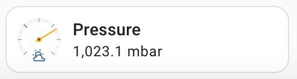

**docs** | [Read me](../README.md) | [Installation](install.md) | **Examples** | [Configuration](config.md) | [Advanced](advanced.md) |

# Ring Tile Card Examples

This page has examples to get you started.

`ring-tile` card is designed to be easy to use. `ring-tile` card automatically configures itself based on a [sensor's `device_type`](config.md/#default-handling). Often, it is enough to just configure the `entity` and `ring-tile` card will take care of the rest. You can tweak it with extra config to make it look just right.

Note that `ring-tile` does not yet support the visual editor, so config must be entered as YAML (which you can do in the visual editor - just search for `ring-tile` card). 

## Standard tiles

`ring-tile` card can be used as a drop in replacement for the inbuilt Home Assistant [`tile` card](https://www.home-assistant.io/dashboards/tile/). Here are some examples.

This is how a humidity sensor looks out of the box:


```yaml
type: custom:ring-tile
entity: sensor.outside_humidity
```

More examples configuring only `type` and `entity`.

Precipitation:


Wind speed:


Battery:


Signal strength:


There's more, but you get the idea.

### Temperature

Temperature sensors get a ring set up for indoor comfort temperatures:


```yaml
type: custom:ring-tile
entity: sensor.bedroom_temperature
```

You can adjust the min and max like this:


```yaml
type: custom:ring-tile
entity: sensor.outside_temperature
min: 1
max: 10
```

Notice how the colouring of the ring automatically adjusts to reflect the new min and max values. Find out how [ring colouring works](config.md/#setting-ring-colours).

You can also use other sensor entities to set the `min` and `max` dynamically. For example:

```yaml
type: custom:ring-tile
entity: sensor.outside_temperature
min: sensor.minimum_temperature_today
max: sensor.forecast_maximum_temperature
```

### Pressure

Barometric pressure sensors look like this:



```yaml
type: custom:ring-tile
entity: sensor.pressure
```

Barometers look even better bigger. It can be handy to add a marker to see how atmospheric pressure is changing. For example:


```yaml
type: custom:ring-tile
entity: sensor.pressure
ring_size: 2
marker: sensor.pressure_6_hours_ago
```

If you'd like to make your own `pressure_6_hours_ago` sensor, [see how I did it](advanced.md/#pressure-6-hours-ago).

## Big tiles

You can make `ring-tile` bigger to feature your sensor data more prominently. The `ring_size` parameter can be set from 1 to 6, which translates to the number of standard tile rows `ring-tile` will take up vertically. Using `ring-tile` with a mix of sizes and colours can help to draw attention to the most important data, giving each sensor visual uniqueness.

### Default big tiles

Out of the box examples for larger `ring_size`s.

`ring_size: 2` is like a standard tile, but double height. Precipitation, for example:


The next size up, `ring_size: 3` is all ring. Here's temperature:


From `ring_size` 3 to 6 it's all ring, just getting bigger. `ring_size: 6` 
takes up a full double standard tile width.

## Customisation examples

There are extensive [configuration options](config.md) available. Here are some examples of what you can do.

### Wind speed and direction

The `compass` `ring_type` is great for showing wind speed and direction at the same time.


```yaml
type: custom:ring-tile
entity: sensor.wind_speed_kmh
marker: sensor.wind_direction_15_min
ring_type: compass_n
ring_size: 3
```

### Adding a scale

You can add a scale to any ring, although they generally work better with larger rings. 


```yaml
type: custom:ring-tile
entity: sensor.climate_upstairs_current_temperature
marker: sensor.climate_upstairs_temperature
min: 19
ring_size: 3
scale: ticks_with_labels
```

This example also includes a dynamic `marker`; here it indicates the current set-point for a thermostat.

### Sensors without a `device_class`

Not all sensors in your setup will have a `device_class`, which might mean a bit more config is needed.


```yaml
type: custom:ring-tile
entity: sensor.nas_cpu_used
ring_type: open
ring_size: 3
top_element: icon
middle_element: value_with_unit
bottom_element: name
name: CPU
icon: mdi:cpu-64-bit
scale: ticks
```

### Ring and display entities

By default, `ring-tile` uses the same entity to plot the ring and display information inside the ring and in the info area. But sometimes you may wish to use a different entity to determine the state of the ring.


```yaml
type: custom:ring-tile
entity: sensor.nas_zpoolused_tarn
ring_entity: sensor.nas_zpool_tarn_percent
ring_size: 2
top_element: icon
middle_element: value_with_unit
```

In this example, numerical data shows the amount of disk space consumed in GB, which come from the `entity` sensor. Meanwhile, the `ring_entity` sensor measures the disk's consumption as a percentage of total capacity, so that the ring indicates a sense of "fullness".

### Tiny tiles

You can also choose to just show the ring for `ring_size` 1 and 2 using `ring_only` (larger rings are always `ring_only`). Combine `ring_only` tiles with the `grid` card to pack a bunch of sensors in together.


```yaml
type: grid
columns: 3
grid_options:
  columns: 6
  rows: auto
square: false
cards:
  - type: custom:ring-tile
    entity: sensor.temperature_kitchen
    middle_element: value_with_unit
    bottom_element: name
    indicator: arc
    ring_only: true
  - type: custom:ring-tile
    entity: sensor.temperature_bedroom
    middle_element: value_with_unit
    bottom_element: name
    indicator: arc
    ring_only: true
  - type: custom:ring-tile
    entity: sensor.temperature_study
    middle_element: value_with_unit
    bottom_element: name
    indicator: arc
    ring_only: true
```

## Up next

Read through the [configuration](config.md) options.

##

**docs** | [Read me](../README.md) | [Installation](install.md) | **Examples** | [Configuration](config.md) | [Advanced](advanced.md) |